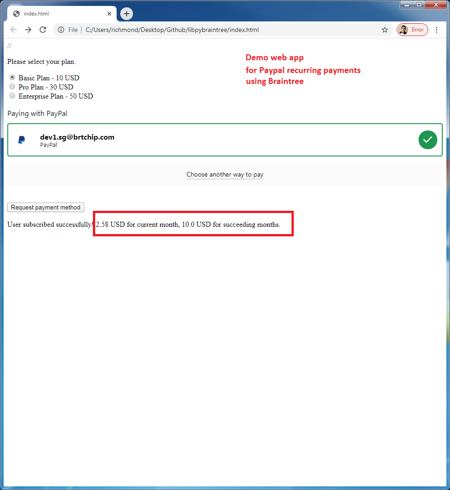
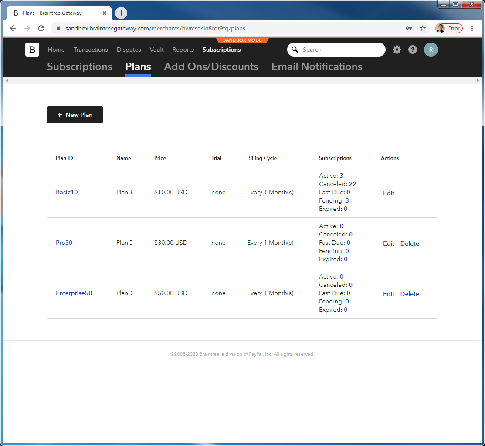
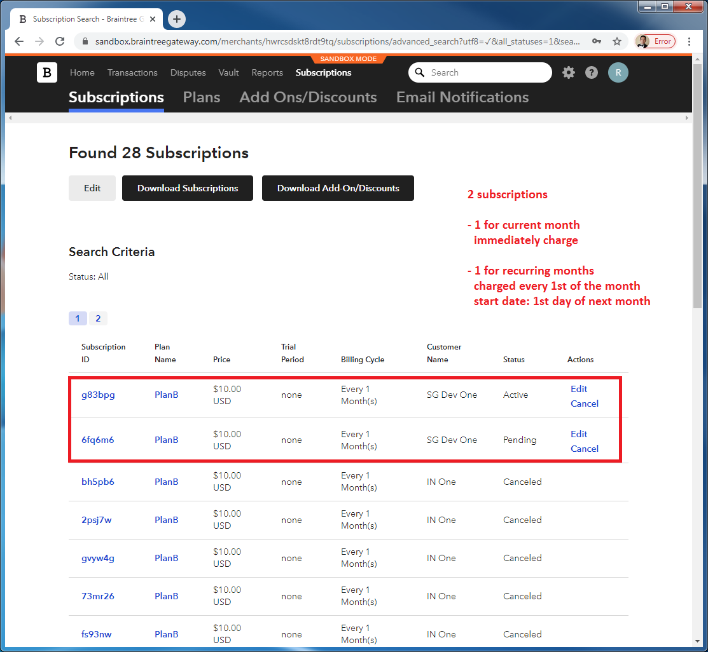
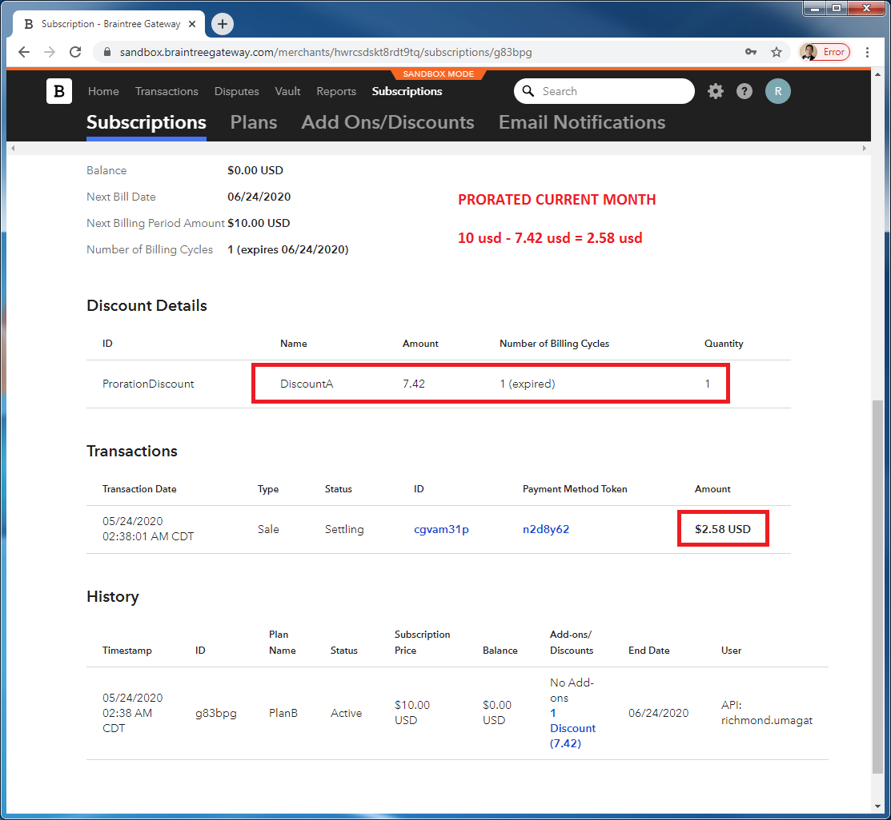
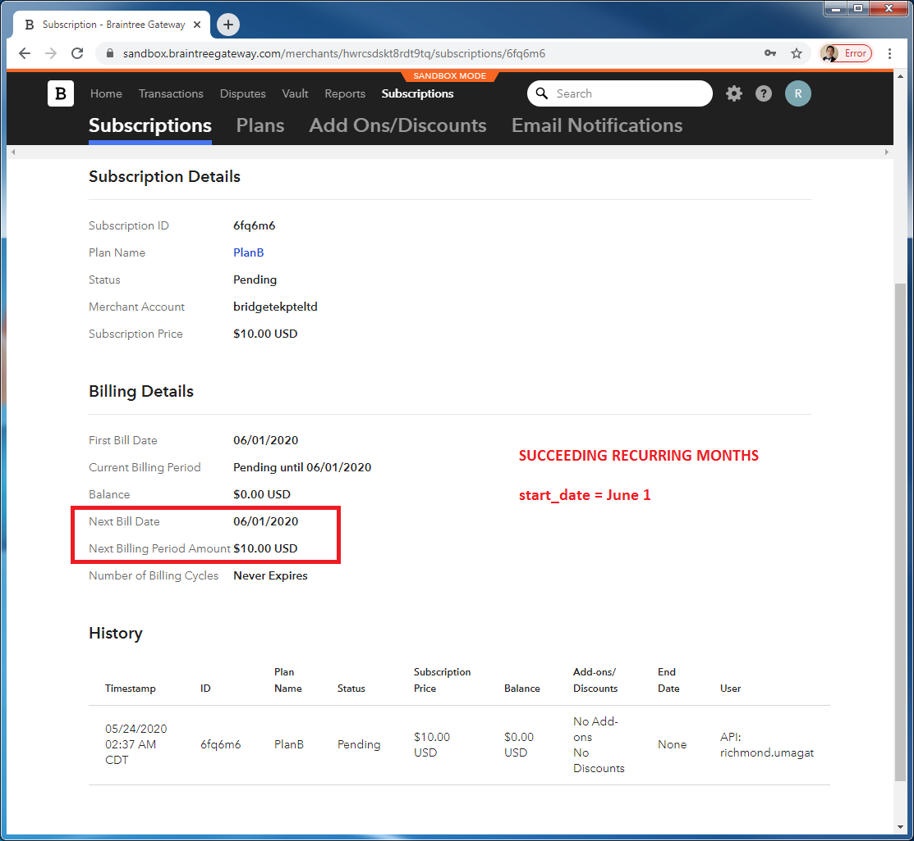
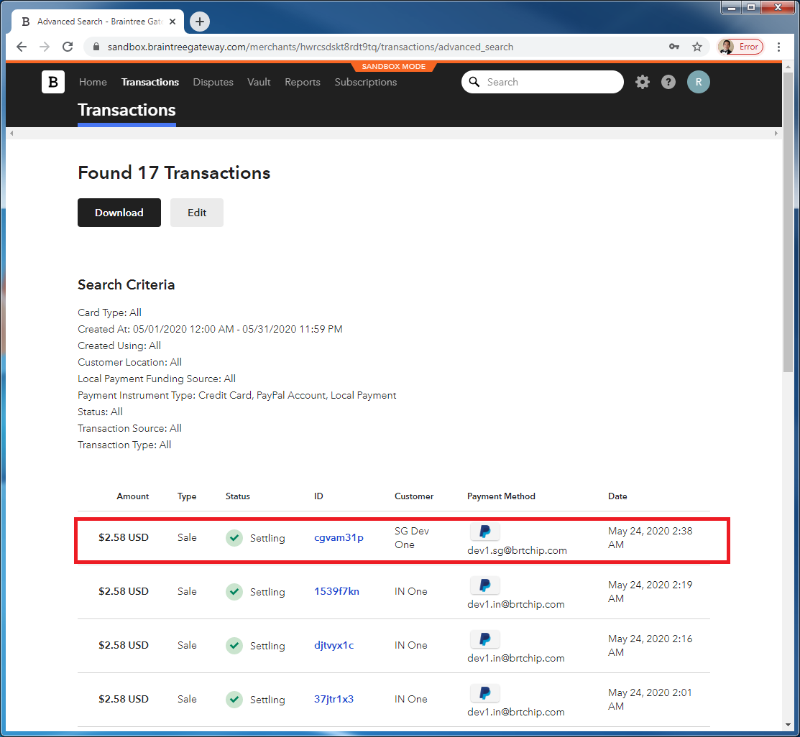

# libpybraintree

libpybraintree demonstrates usage of <b>Braintree's Python SDK</b> for processing online <b>recurring payments</b> including payment using Paypal.

Using <b>Braintree</b> library is easier than Paypal library itself. Braintree is a lot more developer-friendly.
Moreover, Braintree support <b>different payment methods</b> including Paypal, Apple Pay, Google Pay, thus making your web/mobile payment system more robust.
For recurring payments feature, it supports seating plans, provisioning for discounts/addons, dashboard metrics, etc.
Their web app console is far better and more useful compared to Paypal.

To use Paypal library directly, refer to https://github.com/richmondu/libpypaypal
That repository demonstrates how to use the Paypal Python SDK for both normal payments and recurring payments.

# Basic Flow:

0. Frontend uses <b>Drop-in UI</b> (copy paste code for UI) provided by BrainTree
   - https://developers.braintreepayments.com/start/hello-client/javascript/v3
   - https://developers.braintreepayments.com/start/hello-client/android/v3
   - https://developers.braintreepayments.com/start/hello-client/ios/v4

1. Frontend gets <b>client_token authorization</b> from backend
   - Paypal - approval url; Braintree - client_token 

2. Backend retrieves client_token authorization from BrainTree and returns it to frontend

3. Frontend uses client_token to redirect to Paypal page for user consent

4. Customer approves payment

5. Frontend retrieves a <b>NONCE from the dropin UI</b>
   - Paypal - payer ID; Braintree - nonce

6. Frontend passes NONCE to backend (together with payer details)

7. Backend creates the payment transaction and/or subscription to Braintree using NONCE

   <b>1 transaction and 1 subscription</b>
   -  <b>1 transaction for the prorated current month</b> , charged immediately, same plan but prorated based on the remaining days of the month
   -  <b>1 subscription for succeeding recurring months</b>, charged every 1st day of the month, infinite cycle

   <b>Computing the prorated month</b>
   - For Paypal, we use <b>setup_fee for prorated month</b>
   - For Braintree, we use <b>transaction for prorated month</b>

# Backend/Frontend Changes:

To transition from Paypal library to Braintree library, most of the changes are in the backend.

For the frontend, the only risk is integrating the Braintree DropIn UI.
How easy or difficult it is to integrate Braintree DropIn UI in Android or IOS apps is the major concern.
For web app, its really simple as in copy-paste.

Braintree changes in the frontend:
1. Frontend needs to add some Braintree DropIn UI, to display the various payment options and direct the user to corresponding payment page.
   - https://developers.braintreepayments.com/start/hello-client/android/v3 
   - https://developers.braintreepayments.com/start/hello-client/ios/v4
2. For Braintree, we retrieve client_token instead of approval url.
   - Paypal - approval url, payment id
   - Braintree - client_token
3. Then once user completes the payment, frontend sends NONCE string instead of payerID
   - Paypal - payer id, payment id
   - Braintree - nonce

# Instructions:

1. Link BrainTree (sandbox) to the Paypal (sandbox) developer account
   -  If you dont have a Paypal sandbox account yet, refer to https://github.com/richmondu/libpypaypal
   -  The transaction histories will appear on both Braintree and Paypal accounts.

2. Create plans in Braintree (Seating plan)
   -  Ex. Basic10, Pro30, Enterprise50 

3. Copy the Braintree configuration in braintree_config.py

4. Run braintee_manager.bat
   -  This will open up a Google Chrome browser running index.html and run braintree_manager.py application

5. Note: When a customer buys a plan for a device, <b>1 transaction and 1 subscription are created</b>
   -  <b>1 transaction for the prorated current month</b> , charged immediately, same plan but prorated based on the remaining days of the month
   -  <b>1 subscription for succeeding recurring months</b>, charged every 1st day of the month, infinite cycle

# How to test

1. Download this repository

2. Install requirements.txt (pip install -r requirements.txt)

3. Add the following environment variables (or update braintree_config.py directly)
   - BRAINTREE_MERCHANT_ID=
   - BRAINTREE_PUBLIC_KEY=
   - BRAINTREE_PRIVATE_KEY=

4. Run braintree_manager.bat
   - A console application will open
   - A browser will open for index.html

5. Click "Paypal button" then "Paypal Checkout" button
   - This will open up sandbox.paypal.com

6. On the window prompt, login using any of the Paypal CUSTOMER account (dev1.sg@brtchip.com)

7. Approve the payment and click "Save and Continue".
   - This will close the sandbox.paypal.com

8. Click on "Complete payment"
   - Once completed, "user subscribed successfully! X.YZ USD for current month, 10 USD (Plan Basic10) for succeeding months.

9. Verify Paypal account
   - Customer account - verify that X.YZ USD was charged (for current prorated month)
   - Customer account - verify that recurring payment is schedule for 10 USD 
   - Merchant account - verify that X.YZ USD was collected from dev1.sg@brtchip.com
   - Merchant account - verify that recurring payment is schedule for 10 USD for dev1.sg@brtchip.com 

10. Verify  Braintree account
   - Verify under Transactions page that X.YZ USD was charged (for current prorated month)
   - Verify under Subscriptions page that recurring payment is schedule for 10 USD for dev1.sg@brtchip.com for Basic10
   - Verify under Vault page that customer dev1.sg@brtchip.com appears with the corresponding transaction and subscription

# APIs

Note: This is just a simple set of APIs to demonstrate Paypal recurring payments using Braintree libraries

1. <b>Get payment authorization token</b>

   Request:

   - GET /client_token
   - headers: {'Content-Type': 'application/json'}

   Response:

   - {'status': 'OK', 'token': string}

   // This is used by frontend to redirect user to the Paypal page (or other payment) via the Braintree Dropin UI

   // Once the user approves the payment, Braintree will return a NONCE to the frontend

2. <b>Execute payment</b>

   Request:

   - POST /nonce
   - headers: {'Content-Type': 'application/json'}
   - data: {

       'plan':        string, // Subscription plan type Basic10, Pro30, Enterprise50

       'nonce':       string, // Nonce value returned by Braintree to Frontend

       'type':        string, // Payment method type - Paypal, CreditCard, Venmo, ApplePay, GooglePay, SamsungPay

       'details': {
         'email':     string,
         'firstName': string,
         'lastName':  string,
       }
     }

   Response:

   - {'status': 'OK', 'msg': string}

   // The frontend shall use the NONCE in the call to execute payment, including the payment details (ex. plan id)

# Screenshots

# Shifting from Paypal library to Braintree library

### BACKGROUND:

We already decided that we will go for Braintree after release next month.

The major reason to go with Braintree back then was support for 
- upgrading/downgrading/cancellation of one or more subscriptions from a single transaction comprising of multiple subscriptions (CARTS).
- The issue was that the Paypal Python SDK does not support this feature handling dependency issues
- Later on we found out that Paypal supports this but only through direct HTTPS REST API calls.

After familiarizing with Braintree, there are actually better reasons we should go with Braintree.
- Not urgent for the current use-case, but makes system robust for future use-cases

### WHY NOW?:

Why not?

1. We have created an <b>end-to-end demo covering the necessary bases for recurring payments</b> in using Braintree library 
- We know how Braintree works to solve current use-case (Paypal, recurring payments, discounts/promo) 
- We have explored some of the future use-cases (carts concept) 
  - multiple devices A, B, C, different subscription plans on single transaction
  - user can upgrade device A, cancel device B, and downgrade device C

2. <b>Braintree library is very developer friendly</b> than Paypal 
- easy integration of Braintree account to link to a Paypal account 
- the APIs are documented with working examples (for both backend and frontend)
- has provisioning for subscription plans, discounts (promocode), addons, etc.
- web console is well-designed with rich features (reports, metrics, alerts, etc)
- dropin UIs are provided for IOS, Android and Javascript (for easy integration)

3. <b>Frontend integration should be easy</b>
- Mobile team was consulted on integrating the dropin UIs 
  - 3/4 days estimates (Ajith used Braintree before already)
- Similar round-trip transaction (parameter values change) 
  - Frontend gets client_token authorization from backend (Paypal - approval url; Braintree - client_token) 
  - Once customer approves the transaction, frontend sends a NONCE (Paypal - payer ID; Braintree - nonce) 

4. <b>Most of the payment/subscription issues have already been articulated</b> and cleared up with the team and marketing team
-  We don't expect any major issues going forward, atleast for July release

5. <b>Paypal Python library maintenance is no longer active</b>
- v1 library has been depracated
  "This SDK is deprecated. You can continue to use it, but no new features or support requests will be accepted."
- v2 libary is incomplete, does not support recurring payments
  https://github.com/paypal/Checkout-Python-SDK/issues/25
- Paypal basically wants developers to use the HTTPS REST APIs directly or via Braintree (a company they bought)

# Resources:

1. Braintree https://developers.braintreepayments.com/
2. Braintree Paypal payment https://developers.braintreepayments.com/guides/paypal/overview
3. Braintree recurring billing https://developers.braintreepayments.com/guides/recurring-billing/overview

